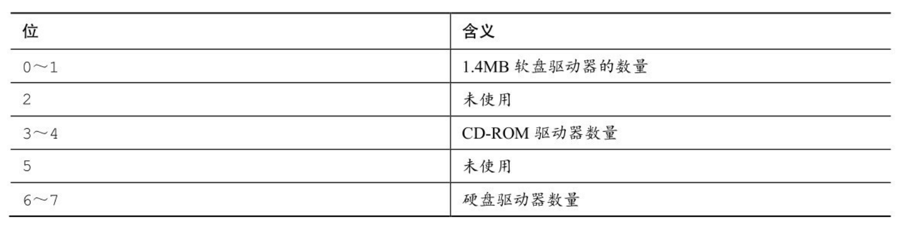

### 复习题
1. **把下面的十进制转换为二进制：**
```
a.3    00000011
b.13   00001101
c.59   00111011
d.119  01110111
```
2. **将下面的二进制值转换为十进制、八进制和十六进制的形式：**
```
a.00010101     1+4+16=21
b.01010101     1+4+16+64=85
c.01001100     4+8+64=80
d.10011101     1+4+8+16+32+128=189
```
3. **对下面的表达式求值，假设每个值都为8位：**
```
a.～3      00000011~11111100
b.3 & 6    00000011&00000110=00000010
c.3 | 6    00000011|00000110=00000111
d.1 | 6    00000001|00000110=00000111
e.3 ^ 6    00000011^00000110=00000101
f.7 >> 1   000000111>>1=00000011
```
4. **对下面的表达式求值，假设每个值都为8位：**
```
a.～0    00000000~11111111
b.!0     00000000!=00000001
c.2 & 4  00000010&00000100=00000000
d.2 && 4 00000001
e.2 | 4  00000010|00000100=00000110
f.2 || 4 00000001
g.5 << 3 00000101<<3=00101000
```
5. **因为ASCII码只使用最后7位，所以有时需要用掩码关闭其他位，其相应的二进制掩码是什么？分别用十进制、八进制和十六进制来表示这个掩码。**
```
二进制掩码是指通过一些0和1的位设置，将某二进制数与掩码&运算，只有掩码为1的位才可见。
二进制：01111111
八进制：0177
十进制：127
十六进制：0x7f
```
6. **程序清单15.2中，可以把下面的代码：**
```
while (bits-- > 0)
{
mask |= bitval;
bitval <<= 1;
}
替换成：
while (bits-- > 0)
{
mask += bitval;
bitval *= 2;
}
```
**程序照常工作。这是否意味着*=2等同于<<=1？+=是否等同于|=？**
```
左移相当于乘以2的幂，与*=2可以等价，但+=与|=只有在不产生进位的时候才等价
```
7. **.a.Tinkerbell计算机有一个硬件字节可读入程序。该字节包含以下信息：**

**Tinkerbell和IBM PC一样，从右往左填充结构位字段。创建一个适合存放这些信息的位字段模板。**
**b.Klinkerbell与Tinkerbell类似，但是它从左往右填充结构位字段。请为Klinkerbell创建一个相应的位字段模板。**
```c
struct 
{
    unsigned int softnum:1;
    unsigned int        :1;
    unsigned int drivernum:3;
    unsigned int      :4;
    unsigned int harddriver:4;
}Tinkerbell;
struct
{
    unsigned int harddriver:4;
    unsigned int      :4;
    unsigned int drivernum:3;
    unsigned int        :1;
    unsigned int softnum:1;
}
```