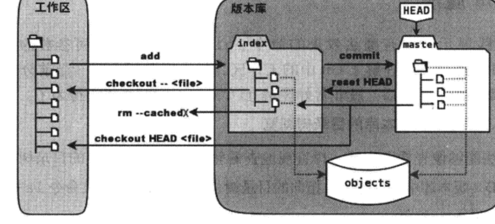

# git学习笔记
<br>
<br>
<br>

***
## 第二节  git暂存区
<br>

### **修改不能直接提交吗**
首先给welcome.txt文件加上一行内容
```
输入内容：2222
```
通过git diff,我们可以看到修改文件与某一中间文件(后文会讲)的差异
```
$git diff
diff --git a/welcome.txt b/welcome.txt
index 5f2f16b..4f142ee 100644
--- a/welcome.txt
+++ b/welcome.txt
@@ -1 +1,2 @@
 1111
+2222

```
下面是 git diff 命令输出的一般格式：

diff --git a/<file> b/<file>
<diff content>

其中 <file> 是文件的路径，<diff content> 则是具体的差异内容。

在 <diff content> 部分，每个差异块由以下几个部分组成：

    @@ -x,y +a,b @@：这是差异块的标识符，表示变更发生的位置。-x,y 表示原文件中的行范围，+a,b 表示新文件中的行范围。

    -：表示原文件中被删除的行。

    +：表示新文件中被添加的行。

     ：（空格）：表示没有变化的行。

现在，让我们来执行提交
```
$git commit -m "Add 2222"
位于分支 master
尚未暂存以备提交的变更：
  （使用 "git add <文件>..." 更新要提交的内容）
  （使用 "git restore <文件>..." 丢弃工作区的改动）
        修改：     welcome.txt

修改尚未加入提交（使用 "git add" 和/或 "git commit -a"）

```
如果我们使用git log就会发现并没有提交，且在commit命令执行时，也提示了要先使用git add后才可以commit,所以我们使用命令git add
```
$git add welcome.txt
(若没提示输出则说明添加成功)
```
现在执行git diff看有什么变化
```
$git diff
```
我们会发现差异消失了，没有像前面一样，但我们并未提交，为什么差异消失了呢，那么接下来我们使用git diff HEAD命令试试(head是指向当前版本库的头指针，这里我们粗略理解为这个命令相当于拿添加后的内容和提交的内容比较)
```
$git diff HEAD
diff --git a/welcome.txt b/welcome.txt
index 5f2f16b..4f142ee 100644
--- a/welcome.txt
+++ b/welcome.txt
@@ -1 +1,2 @@
 1111
+2222

```
(git log 用于查看提交历史，显示所有的提交记录。
git status 用于查看工作目录和暂存区的状态，显示当前文件的修改情况和分支状态。)
我们使用git status来查看
```
$git status
位于分支 master
要提交的变更：
  （使用 "git restore --staged <文件>..." 以取消暂存）
        修改：     welcome.txt

```
也可以使用简洁输出
```
$git status -s
M  welcome.txt
 |
(这有个空格)
```
位于第一列的M表示版本库文件与中间状态的提交任务中的文件有差异
位于第二列的空白表示工作区的文件与中间状态的提交任务的文件没有差异
即对于这两列，若为M则有差异，空格则没差异
比如现在再给welcome.txt添加内容
```
输入内容：3333
```
使用git status
```
$git status
要提交的变更：
  （使用 "git restore --staged <文件>..." 以取消暂存）
        修改：     welcome.txt

尚未暂存以备提交的变更：
  （使用 "git add <文件>..." 更新要提交的内容）
  （使用 "git restore <文件>..." 丢弃工作区的改动）
        修改：     welcome.txt

$git status -s
MM welcome.txt

```
我们再使用git diff查看差异
```
$git diff(工作区和暂存区)
diff --git a/welcome.txt b/welcome.txt
index 4f142ee..e0037f0 100644
--- a/welcome.txt
+++ b/welcome.txt
@@ -1,2 +1,3 @@
 1111
 2222
+3333

$git diff HEAD(工作区与当前分支)
diff --git a/welcome.txt b/welcome.txt
index 5f2f16b..e0037f0 100644
--- a/welcome.txt
+++ b/welcome.txt
@@ -1 +1,3 @@
 1111
+2222
+3333

$git diff --cached(或--staged,，暂存区与工作分支)
diff --git a/welcome.txt b/welcome.txt
index 5f2f16b..4f142ee 100644
--- a/welcome.txt
+++ b/welcome.txt
@@ -1 +1,2 @@
 1111
+2222

```
现在执行提交
```
$git commit -m "Add 2222"
[master aebd02e] Add 2222
 1 file changed, 1 insertion(+)

```
这里提交的welcome版本是版本“2”，因为版本“3”还没add.
<br>

### 理解暂存区(stage)
其实，我们前面所提到的中间状就是暂存区，那么什么是是暂存区呢？在.git文件下有一个index文件，我们针对这个文件做些测试。
首先，我们执行git checkout命令(后文介绍)，来撤销工作区中暂未提交的修改
```
$git checkout -- welcome.txt
$git status -s(查看修改)
```
我们发现修改已经消失了，接下来我们查看一下.git/index文件，注意文件时间戳(时间戳是一个用于表示特定时间的数值或字符串。它通常表示从某个固定的起始时间点（例如UNIX纪元，即1970年1月1日00:00:00 UTC）经过的秒数或毫秒数。)
```
$ls --full-time .git/index
-rw-r--r-- 1 lankun lankun 145 2023-11-26 11:46:45.828044186 +0800 .git/index
```
再次执行一次
```
$git status -s
ls --full-time .git/index
```
我们发现时间戳并没有变化，现在我们修改welcome.txt的时间戳
```
$touch welcome.txt
$git status -s
ls --full-time .git/index
-rw-r--r-- 1 lankun lankun 145 2023-11-26 11:55:59.182537637 +0800 .git/index
(时间戳发生了变化！)
```
我们可以发现.git/index记录了文件的时间戳，其实index中还记录了文件的长度等判断信息，当执行git status时，会先判断时间戳是否改变，若改变则说明文件可能发生改变，则进入文件进行进一步判断，若没改变，则将新的时间戳记录到index。这样通过时间戳，文件长度等进行判断比通过文本内容快很多，也是git高效的原因。


