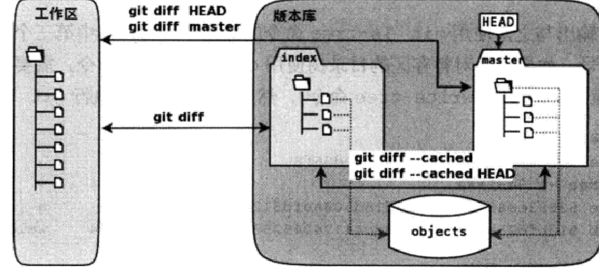

# git学习笔记
<br>
<br>
<br>

***
## 第二节  git暂存区
<br>

### **修改不能直接提交吗**
首先给welcome.txt文件加上一行内容
```
输入内容：2222
```
通过git diff,我们可以看到修改文件与某一中间文件(后文会讲)的差异
```
$git diff
diff --git a/welcome.txt b/welcome.txt
index 5f2f16b..4f142ee 100644
--- a/welcome.txt
+++ b/welcome.txt
@@ -1 +1,2 @@
 1111
+2222

```
下面是 git diff 命令输出的一般格式：

diff --git a/<file> b/<file>
<diff content>

其中 <file> 是文件的路径，<diff content> 则是具体的差异内容。

在 <diff content> 部分，每个差异块由以下几个部分组成：

    @@ -x,y +a,b @@：这是差异块的标识符，表示变更发生的位置。-x,y 表示原文件中的行范围，+a,b 表示新文件中的行范围。

    -：表示原文件中被删除的行。

    +：表示新文件中被添加的行。

     ：（空格）：表示没有变化的行。

现在，让我们来执行提交
```
$git commit -m "Add 2222"
位于分支 master
尚未暂存以备提交的变更：
  （使用 "git add <文件>..." 更新要提交的内容）
  （使用 "git restore <文件>..." 丢弃工作区的改动）
        修改：     welcome.txt

修改尚未加入提交（使用 "git add" 和/或 "git commit -a"）

```
如果我们使用git log就会发现并没有提交，且在commit命令执行时，也提示了要先使用git add后才可以commit,所以我们使用命令git add
```
$git add welcome.txt
(若没提示输出则说明添加成功)
```
现在执行git diff看有什么变化
```
$git diff
```
我们会发现差异消失了，没有像前面一样，但我们并未提交，为什么差异消失了呢，那么接下来我们使用git diff HEAD命令试试(head是指向当前版本库的头指针，这里我们粗略理解为这个命令相当于拿添加后的内容和提交的内容比较)
```
$git diff HEAD
diff --git a/welcome.txt b/welcome.txt
index 5f2f16b..4f142ee 100644
--- a/welcome.txt
+++ b/welcome.txt
@@ -1 +1,2 @@
 1111
+2222

```
(git log 用于查看提交历史，显示所有的提交记录。
git status 用于查看工作目录和暂存区的状态，显示当前文件的修改情况和分支状态。)
我们使用git status来查看
```
$git status
位于分支 master
要提交的变更：
  （使用 "git restore --staged <文件>..." 以取消暂存）
        修改：     welcome.txt

```
也可以使用简洁输出
```
$git status -s
M  welcome.txt
 |
(这有个空格)
```
位于第一列的M表示版本库文件与中间状态的提交任务中的文件有差异
位于第二列的空白表示工作区的文件与中间状态的提交任务的文件没有差异
即对于这两列，若为M则有差异，空格则没差异
比如现在再给welcome.txt添加内容
```
输入内容：3333
```
使用git status
```
$git status
要提交的变更：
  （使用 "git restore --staged <文件>..." 以取消暂存）
        修改：     welcome.txt

尚未暂存以备提交的变更：
  （使用 "git add <文件>..." 更新要提交的内容）
  （使用 "git restore <文件>..." 丢弃工作区的改动）
        修改：     welcome.txt

$git status -s
MM welcome.txt

```
我们再使用git diff查看差异
```
$git diff(工作区和暂存区)
diff --git a/welcome.txt b/welcome.txt
index 4f142ee..e0037f0 100644
--- a/welcome.txt
+++ b/welcome.txt
@@ -1,2 +1,3 @@
 1111
 2222
+3333

$git diff HEAD(工作区与当前分支)
diff --git a/welcome.txt b/welcome.txt
index 5f2f16b..e0037f0 100644
--- a/welcome.txt
+++ b/welcome.txt
@@ -1 +1,3 @@
 1111
+2222
+3333

$git diff --cached(或--staged,，暂存区与工作分支)
diff --git a/welcome.txt b/welcome.txt
index 5f2f16b..4f142ee 100644
--- a/welcome.txt
+++ b/welcome.txt
@@ -1 +1,2 @@
 1111
+2222

```
现在执行提交
```
$git commit -m "Add 2222"
[master aebd02e] Add 2222
 1 file changed, 1 insertion(+)

```
这里提交的welcome版本是版本“2”，因为版本“3”还没add.
<br>

### 理解暂存区(stage)
其实，我们前面所提到的中间状就是暂存区，那么什么是是暂存区呢？在.git文件下有一个index文件，我们针对这个文件做些测试。
首先，我们执行git checkout命令(后文介绍)，来撤销工作区中暂未提交的修改
```
$git checkout -- welcome.txt
$git status -s(查看修改)
```
我们发现修改已经消失了，接下来我们查看一下.git/index文件，注意文件时间戳(时间戳是一个用于表示特定时间的数值或字符串。它通常表示从某个固定的起始时间点（例如UNIX纪元，即1970年1月1日00:00:00 UTC）经过的秒数或毫秒数。)
```
$ls --full-time .git/index
-rw-r--r-- 1 lankun lankun 145 2023-11-26 11:46:45.828044186 +0800 .git/index
```
再次执行一次
```
$git status -s
ls --full-time .git/index
```
我们发现时间戳并没有变化，现在我们修改welcome.txt的时间戳
```
$touch welcome.txt
$git status -s
ls --full-time .git/index
-rw-r--r-- 1 lankun lankun 145 2023-11-26 11:55:59.182537637 +0800 .git/index
(时间戳发生了变化！)
```
我们可以发现.git/index记录了文件的时间戳，其实index中还记录了文件的长度等判断信息，当执行git status时，会先判断时间戳是否改变，若改变则说明文件可能发生改变，则进入文件进行进一步判断，若没改变，则将新的时间戳记录到index。这样通过时间戳，文件长度等进行判断比通过文本内容快很多，也是git高效的原因。
.git/index实际上就是包含文件索引的目录树，记录了文件名和文件的状态信息，但没有储存文件内容，内容保存在.git/objects目录中，文件索引建立了文件和对象库中对象实体的关系

左侧1为工作区，右侧为版本库，版本库中的index即为暂存区，master即为master分支的目录树(对应的文件也应该保存在对象区)
HEAD为指向master的“游标”
<br>
在执行git add命令时，暂存区的目录树会更新，同时工作区修改的内容被写入对象库中的一个新对象中，该对象的ID被记录到暂存区文件索引中
当执行git commit命令时，暂存区的目录树会写到对象库中，master更新指向的目录树，最新指向的目录树就是暂存区的目录树
当执行git reset HEAD命令时，暂存区的目录树被master分支的目录树替换，工作区不受影响。
当执行git rm --cached <file>命令时，会直接从暂存区删除文件，工作区不做改变。(文件还保存在对象区，没有被删除，保证可以回溯版本)
当执行git checkout .或git checkout --<file>命令时，会把暂存区的全部或指定文件替换工作区文件，这个操作会清除未添加到暂存区的改动
当执行git checkout HEAD .或git checkout -- <file>会将master分支中的全部内容或指定文件替换暂存区和工作区，当然，暂存区和工作区的未提交改动会被清除

### Git Diff魔法

让我们来查看各个目录树
为了让不同目录树差异明显，我们做些准备工作
首先清除工作区并执行git checkout
```
$git clean -fd
$git choekout .
```
然后添加内容
```
输入内容“3333”
$mkdir -p a/b/c  //mkdir -p 参数允许你在创建目录时自动创建所需的父级目录，而不会因为缺少父级目录而报错。这样可以方便地创建多级目录结构。
$touch Hello.txt
输入内容4444
$git add .
输入内容5555
$git status -s
AM a/b/c/Hello.txt  //A：新增（Added）的文件，尚未添加到版本控制。
M  welcome.txt
```
现在工作区，暂存区和master分支各不相同
```
$git ls-tree -l HEAD  //-l参数表示显示文件大小
100644 blob 4f142ee300fd3f4fa2e89c76c76c0923d911f7ea      10    welcome.txt
```
    100644：这是文件的权限模式，以八进制表示。在这个例子中，100644 表示文件的权限为 -rw-r--r--，即文件所有者具有读写权限，其他用户只有读权限。

    blob：这是 Git 中表示文件类型的标识符。在这个例子中，blob 表示这是一个普通的文件。//Git中的Blob对象是用于存储文件内容的数据类型，它代表Git仓库中的一个文件，并以二进制形式保存文件的内容。

    4f142ee300fd3f4fa2e89c76c76c0923d911f7ea：这是文件的对象 ID，也称为 SHA-1 值或哈希值。每个文件在 Git 中都会被分配一个唯一的对象 ID，用于标识文件的内容。

    10：这是文件的大小，以字节为单位。在这个例子中，文件的大小为 10 字节。

    welcome.txt：这是文件的名称。在这个例子中，文件名为 welcome.txt。

综上所述，该输出表示在当前提交（HEAD）下，存在一个名为 welcome.txt 的文件，其权限为 -rw-r--r--，大小为 10 字节，对象 ID 为 4f142ee300fd3f4fa2e89c76c76c0923d911f7ea。
```
$git ls-files -s  //暂存区的目录树
100644 b0f6d94e939d2ec0db6e489aa9fc4854664ef923 0       a/b/c/Hello.txt
100644 e0037f05868f8aec30670b1c09de3ba6f22a30ec 0       welcome.txt
```
注意，这里第三个字段是文件的编号
如果想针对暂存区目录树使用git ls-tree,需要先将暂存区的目录树写入git对象库
```
$git write-tree
d912fbae75abfbb1d6ae2ebc4b6c68e0096a5921
$git ls-tree -l d912fbae
040000 tree 228f94521aa9691cdfcec097986b535968d1f00b       -    a
100644 blob e0037f05868f8aec30670b1c09de3ba6f22a30ec      15    welcome.txt
```
tree 是Git中的一种对象类型，用于表示目录或目录结构。它包含了目录中的子项信息，包括子目录和文件的权限、对象类型、对象 ID、大小和名称。通过 tree 对象，Git能够有效地组织和存储文件和目录的层次结构，并跟踪它们的变化。

git diff  工作区和暂存区比较
git diff --cached  暂存区和HEAD比较
git diff HEAD  工作区和HEAD比较

### 补充git commit -a
对本地所有变更文件执行提交，包括本地修改和删除的文件，但不包括未被版本库跟踪文件，省去了git add,但尽量不要用