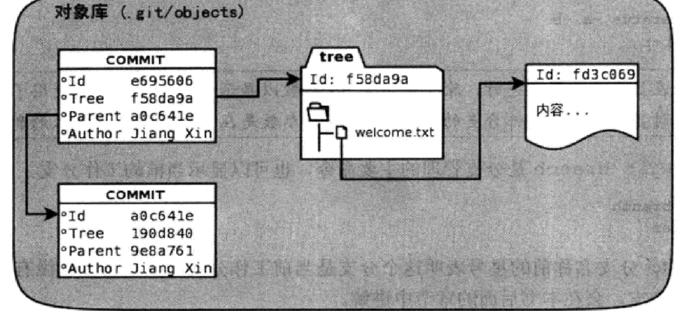
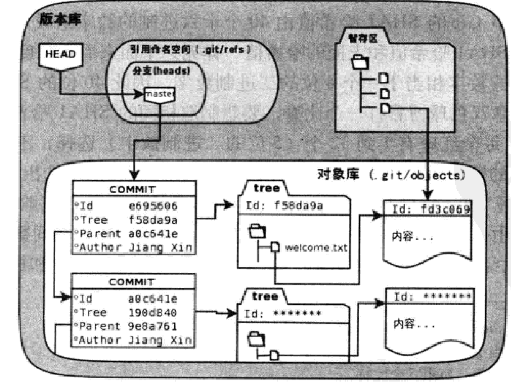

# git学习笔记
<br>
<br>
<br>

***
## 第三节 git对象库
### git对象库探秘
让我们先来查看一下详细日志
```
$git log -l --pretty=raw
commit aebd02e60903a4087a720193e9d376f247a4ab89
tree 90367d5b3af0f60c3f511600c01df805eb1c11b5
parent 09bfc1d650e512fce82b9d870bc31f9d75f7cd34
author lankunGitHub <lkLKlkLKlkLK09@outlook.com> 1700969744 +0800
committer lankunGitHub <lkLKlkLKlkLK09@outlook.com> 1700969744 +0800

    Add 2222
```
现在，让我们使用一个有用的命令
```
$git cat-file -t aebd02e
commit
$git cat-file -t 90367d5b
tree
git cat-file -t 09bfc
commit
//-t参数用于查询给定对象的类型
ID不要写全，只要可以辨认就行
```
接下来让我们来看看其中具体内容
```
$git cat-file -p aebd02e
tree 90367d5b3af0f60c3f511600c01df805eb1c11b5
parent 09bfc1d650e512fce82b9d870bc31f9d75f7cd34
author lankunGitHub <lkLKlkLKlkLK09@outlook.com> 1700969744 +0800
committer lankunGitHub <lkLKlkLKlkLK09@outlook.com> 1700969744 +0800

Add 2222
$git cat-file -p 90367d5b
100644 blob 4f142ee300fd3f4fa2e89c76c76c0923d911f7ea    welcome.txt
$git cat-file -p 09bfc
tree 48c02e84472d13fae06dbb6e70627471a43d238f
author lankunGitHub <lkLKlkLKlkLK09@outlook.com> 1700487685 +0800
committer lankunGitHub <lkLKlkLKlkLK09@outlook.com> 1700487685 +0800

Add welcome.txt
//-p参数表示显示对象给定的内容
```
其中我们看到一个blob类型的对象，这个对象保存着welcome.txt的内容
```
$git cat-file -p 4f142ee300fd
1111
2222
```
这些对象保存在git的对象库里，ID的前两位表示目录名，后38位表示文件名
```
.git/objects/ae/bd02e60903a4087a720193e9d376f247a4ab89
```
下面图片形象显示对象库各对象关系

git各对象的关联可以很容易识别出一条追踪链，我们通过git log的--graph参数可以看到
```
* commit aebd02e60903a4087a720193e9d376f247a4ab89
| tree 90367d5b3af0f60c3f511600c01df805eb1c11b5
| parent 09bfc1d650e512fce82b9d870bc31f9d75f7cd34
| author lankunGitHub <lkLKlkLKlkLK09@outlook.com> 1700969744 +0800
| committer lankunGitHub <lkLKlkLKlkLK09@outlook.com> 1700969744 +0800
| 
|     Add 2222
| 
* commit 09bfc1d650e512fce82b9d870bc31f9d75f7cd34
  tree 48c02e84472d13fae06dbb6e70627471a43d238f
  author lankunGitHub <lkLKlkLKlkLK09@outlook.com> 1700487685 +0800
  committer lankunGitHub <lkLKlkLKlkLK09@outlook.com> 1700487685 +0800
  
      Add welcome.txt

```
最后一个提交没有parent属性，所以跟踪链到此终结，这实际上就是提交的起点
<br>

现在就是关于HEAD和master分支
对于分支，我们使用的主要分支管理命令就是git branch,该命令也可以显示当前分支
```
$git branch
* master  //*表示当前分支，对于为什么没有其他分支和什么是分支，我们后面解释
```
现在执行下面三个命令
```
$git log -1 HEAD
commit aebd02e60903a4087a720193e9d376f247a4ab89 (HEAD -> master)
Author: lankunGitHub <lkLKlkLKlkLK09@outlook.com>
Date:   Sun Nov 26 11:35:44 2023 +0800

    Add 2222
$git log -1 master
Author: lankunGitHub <lkLKlkLKlkLK09@outlook.com>
Date:   Sun Nov 26 11:35:44 2023 +0800

    Add 2222
$git log -1 refs/heads/master
commit aebd02e60903a4087a720193e9d376f247a4ab89 (HEAD -> master)
Author: lankunGitHub <lkLKlkLKlkLK09@outlook.com>
Date:   Sun Nov 26 11:35:44 2023 +0800

    Add 2222
```
三个命令输出相同，说明它们有相同的指向，现在我们一探究竟
```
$find .git -name HEAD -o -name master
.git/refs/heads/master
.git/HEAD
.git/logs/refs/heads/master
.git/logs/HEAD
```
我们先不管.git/logs,先看前两个
```
$cat .git/HEAD
ref: refs/heads/master
//把HEAD内容翻译过来就是：“指向一个引用：refs/heads/master”
$cat .git/refs/heads/master
aebd02e60903a4087a720193e9d376f247a4ab89
//对于这个ID我们是熟悉的，所以master分支指向最新提交ID
```

目录.git/refs是保存引用的命名空间，其中.git/refs/heads目录下的引用又称分支，git rev-parse可以用于显示引用的提交ID
```
$git rev-parse master
aebd02e60903a4087a720193e9d376f247a4ab89
```
### SHA1haxi值是什么，如何生成     x
### 为什么不用顺序的数字来表示提交
对于集中式的版本控制系统，因为只有一个版本库，所以可以很容易的实现依次递增的唯一提交号。而对于git来说却不同，每个人都可以可以克隆和提交版本库，采用本地唯一数字编号会造成冲突。
但是git这种处理方法也存在一定问题，这使得对于管理编号变得十分复杂，对此，git也使用了一些解决办法
不用写全哈希值，只要不与现有哈希值冲突就行
使用master分支代表最新提交
使用HEAD代表最近提交，^代表父提交，^^代表父提交的父提交，对于多个，我们可以用～n表示第n个父提交