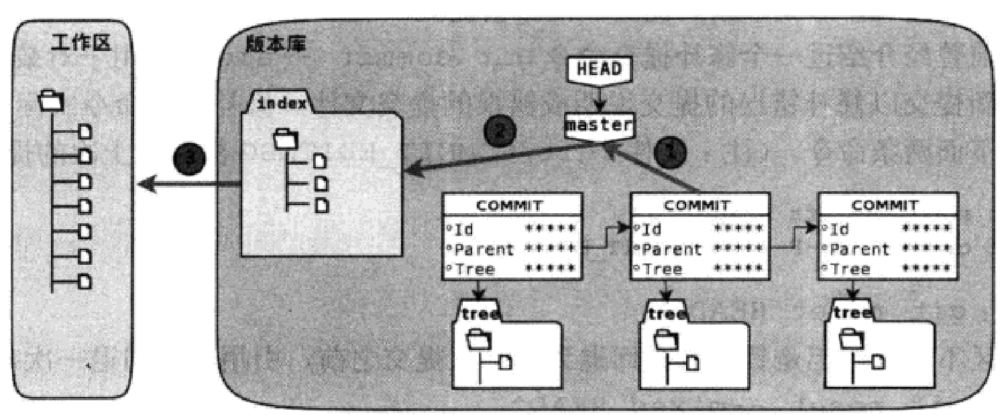

# git学习笔记
<br>
<br>
<br>

***
## git重置
<br>

### 分支游标master探秘
先来看看当发生新提交时文件.git/refs/heads/master内容如何改变
```
$touch new_commit.txt
$git add new_commit.txt
$git commit -m "Add new_commit.txt"
[master 2f1d36f] Add new_commit.txt
 3 files changed, 2 insertions(+)
 create mode 100644 a/b/c/Hello.txt
 create mode 100644 new_commit.txt
$ls -l
总计 8
drwxr-xr-x 3 lankun lankun 4096 11月30日 19:02 a
-rw-r--r-- 1 lankun lankun    0 12月 2日 22:33 new_commit.txt
-rw-r--r-- 1 lankun lankun   15 11月30日 18:58 welcome.txt
```
让我们来看看master分支指向的ID是否改变了
```
$cat .git/refs/heads/master
2f1d36f9b99a6ede0435a0f11698881f938b2ed0
```
很明显，ID发生了改变，再来查看一下提交日志
```
$git log --graph --oneline 
* 2f1d36f (HEAD -> master) Add new_commit.txt
* aebd02e Add 2222
* 09bfc1d Add welcome.txt
```
引用refs/heads/master就好象一个游标，在有新提交时指向了新提交。
同时我们使用git reset可以将游标指向任意一个ID
```
$git reset --hard HEAD^
HEAD 现在位于 aebd02e Add 2222
```
现在我们再查看.git/refs/heads/master就会发现ID指向前一次提交，我们可以用这个方法重置到任意一个提交版本。
那么我们还可以通过查看丢弃ID再回到新版本，很遗憾不可能，因为重置让提交历史改变了，我们再显示日志如下
```
$git log 
commit aebd02e60903a4087a720193e9d376f247a4ab89 (HEAD -> master)
Author: lankunGitHub <lkLKlkLKlkLK09@outlook.com>
Date:   Sun Nov 26 11:35:44 2023 +0800

    Add 2222

commit 09bfc1d650e512fce82b9d870bc31f9d75f7cd34
Author: lankunGitHub <lkLKlkLKlkLK09@outlook.com>
Date:   Mon Nov 20 21:41:25 2023 +0800

    Add welcome.txt
```
我们新添加的那次提交不见了
### 用reflog挽救错误的配置
git提供了一个挽救机制，通过.git/logs目录下的日志文件记录了分支的变更。默认非裸版本库都提供分支日志功能，这是因为工作区的版本库有设置
```
$git config core.logallrefupdates
ture
```
现在查一下master分支的日志文件
```
$tail -5 .git/logs/refs/heads/master
0000000000000000000000000000000000000000 09bfc1d650e512fce82b9d870bc31f9d75f7cd34 lankunGitHub <> 1700487685 +0800      commit (initial): Add welcome.txt
09bfc1d650e512fce82b9d870bc31f9d75f7cd34 aebd02e60903a4087a720193e9d376f247a4ab89 lankunGitHub <> 1700969744 +0800      commit: Add 2222
aebd02e60903a4087a720193e9d376f247a4ab89 2f1d36f9b99a6ede0435a0f11698881f938b2ed0 lankunGitHub <> 1701527640 +0800      commit: Add new_commit.txt
2f1d36f9b99a6ede0435a0f11698881f938b2ed0 aebd02e60903a4087a720193e9d376f247a4ab89 lankunGitHub <> 1701528484 +0800      reset: moving to HEAD^
```
可以看到这个文件记载了master分支的变迁，，我们使用命令git reflog进行文件操作，使用show可以显示文件内容
```
$git reflog show master | head -5
aebd02e master@{0}: reset: moving to HEAD^
2f1d36f master@{1}: commit: Add new_commit.txt
aebd02e master@{2}: commit: Add 2222
09bfc1d master@{3}: commit (initial): Add welcome.txt
```
重置master
```
$git reset --hard master@{1}
HEAD 现在位于 2f1d36f Add new_commit.txt
$git log --oneline
2f1d36f (HEAD -> master) Add new_commit.txt
aebd02e Add 2222
09bfc1d Add welcome.txt
```
new_commit.txt文件又回来了,日志也恢复了
<br>

### 深入了解git reset命令
```
用法一:git reset [-q] [<commit>] [--] <paths>
用法二:git reset [--sort | --mixed | --hard | --merge | --keep] [-q] [<commit>]
```
第一种用法不会重置引用，不会更改工作区，而是提交指定状态(<commit>)下的文件(<path>)替换暂存区的文件，相当于取消之前add改变的暂存区

1.替换引用指向
2.替换暂存区
3.替换工作区
使用--hard参数将执行1,2,3全部操作。
使用--soft参数将执行1操作。
使用--mixed或不使用参数将执行1,2操作
